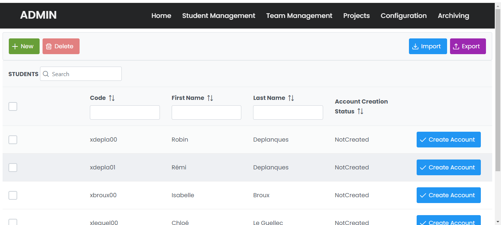
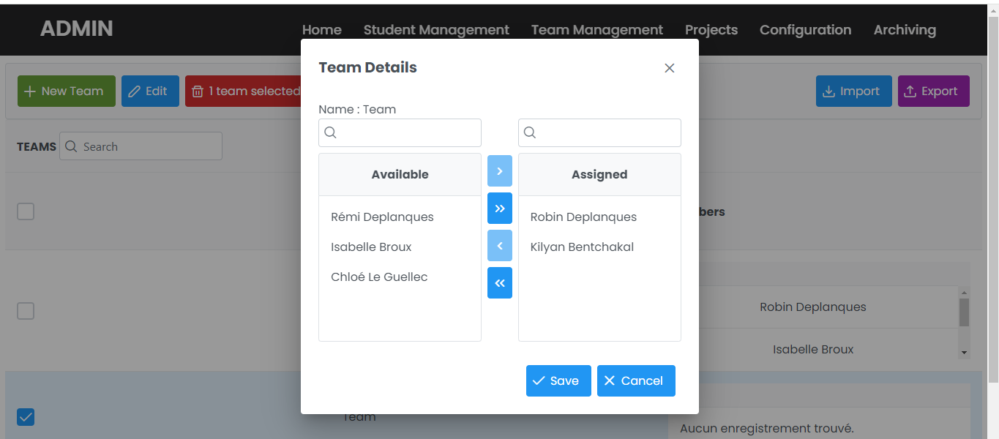
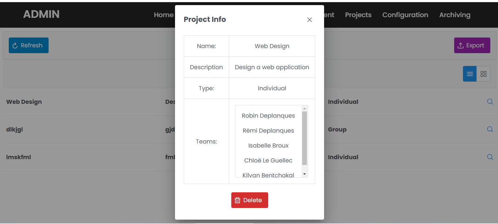
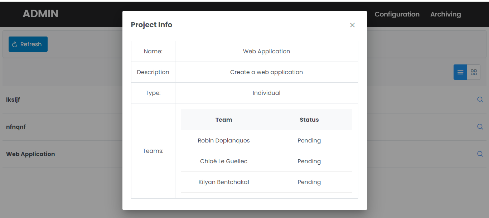

# Java-user-interface
## Objective :  
The project aims to develop a web application for managing a Linux-based teaching server. This application, for each course associated with the server, will enable the import of student and team lists, creation of user accounts with password delivery via email, firewall configuration by students, formation of user groups for teams, establishment of shared and individual work folders for projects, tracking of submissions, archiving of current-year data, and deletion of student accounts.  
## Features :  
- Create/Delete Student
- Create/Delete Teams (composed of Students)
- Create/Delete/Archive Projects (Composed of Teams or Students (i.e. Individual or Group project))
- Delete Archived Projects
- Add/Remove Teams to Projects    
- Submission Tracking of Projects
- Database to load/store data even if the server is restart

  

   
 
  

## First Use :  
Load every webpage from left to right in order to initialize the Database properly. It will take some time to load the pages for the first time.  
The credentials to connect as Admin are :
- User : admin
- Password : admin  
## Installation :  
### Without changes :  
To run the project just put the Java_Interface_Project.war file that is inside the Java_Interface_Project folder into the webapp folder of your tomcat server. It will automatically deploy the web application at the web address ip:tomcatPort/Java_Interface_Project.
### With changes :  
If you want to modify the project you can open it as an eclipse project. Everything is already set up. The project is running with Maven to handle the dependencies.   
## Dependencies :  
- Prime Faces : 12.0.0
- Java Server Faces : 2.2.18
- JDK : 17
- Tomcat : [9.0.84](https://dlcdn.apache.org/tomcat/tomcat-9/v9.0.85/bin/apache-tomcat-9.0.85.zip)  
**The dependencies are (except for tomcat) handles by Maven**  
## DATABASE :  
**The database is already implemented with H2**. Once you run the project the files will be automatically create.  
It is located in your "root/\~/" (for windows it's : "C:/\~/").  
The data in  the following tables are here as example. For this example you'll find the case of a Group Project with 1 Team assigned. The team is composed of 2  students.
### Student  
| id | code | firstName | lastName | password | accountCreation |
|:--:|:----:|:---------:|:--------:|:--------:|:---------------:|
|  A |  abc |    fred   |  mercury |  ******  |     Created     |
|  B |  def |   michel  | polnaref |  ******  |    NotCreated   |  
### Groupe  
| id |     name   | student |
|:--:|:----------:|:-------:|
|  D |   BroTeam  |   A:B:  |  
### Team  
| id | teammate |  submit  |
|:--:|:--------:|:--------:|
|  C |    D:    | Pending: |  
### Project  
| id |       description       |    name    |  type |
|:--:|:-----------------------:|:----------:|:-----:|
|  C | Create a Web Design app | Web Design | Group |    
### Archive  
| id |       description       |    name    |  type |
|:--:|:-----------------------:|:----------:|:-----:|
|    |                         |            |       |  
### HOW TO EDIT DATABASE (Manually, only if needed)  
Run `java -jar C:\Users\Robin\.m2\repository\com\h2database\h2\2.2.224\h2-2.2.224.jar` (**Replace with your own path**)  
It will open a web page and there set :  
- URL JDBC : jdbc:h2:/~/database
- username : user
- password : user

**DO NOT FORGET TO STOP YOUR TOMCAT SERVER BEFORE CONNECTING**  
**DO NOT FORGET TO DISCONNECT FROM THE DATABASE BEFORE STARTING YOUR TOMCAT SERVER**

## Architecture of class dependencies
- Project
  - Project Team (Interface)
    - Team
      - Student
    - Student  
  
  
# TODO : Remaining List 
- Add security for pages (You can't modify login.xhtml in home.xhtml and have access to home.xhtml, filters from Maven or other possibilities)
- Student View for submission of files (or directly when files are put on submission folder, so no Student View needed)
- Manage import of Students via CSV file
- Manage import of Projects via CSV file
- Manage import of Teams via CSV file
- Manage Export of Project
- Manage Export of Students
- Manage Export of Teams
- Send password via Email when an account is create (maybe too hard to manage)
- **Create folder for Group project**
- **Create folder for Individual project**
- **Create folder for Submission project**
- **Creation of user**
- **Creation of userGroup**
- **Manage Firewall rule (See if it's useful)**

**The bold tasks needed a working Linux server.**  
**NB:** The bold tasks can be realize using @Schedule in a @Singleton bean and asking periodically the Database to create user / userGroup / folders.

# Authors :  
Robin Deplanques  
Kilyan Bentchakal  
